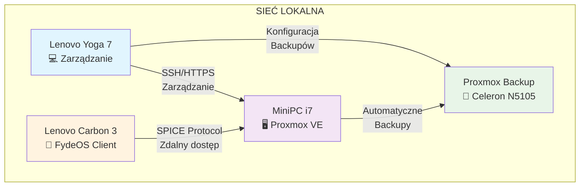
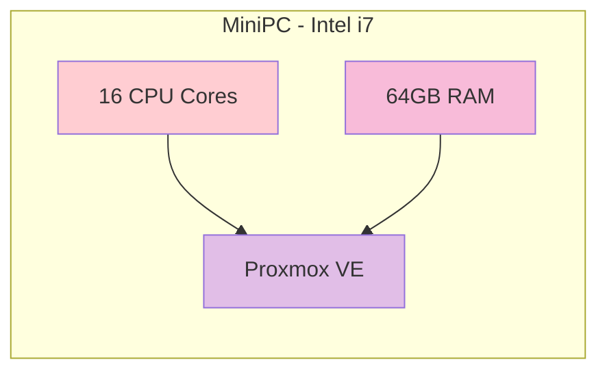
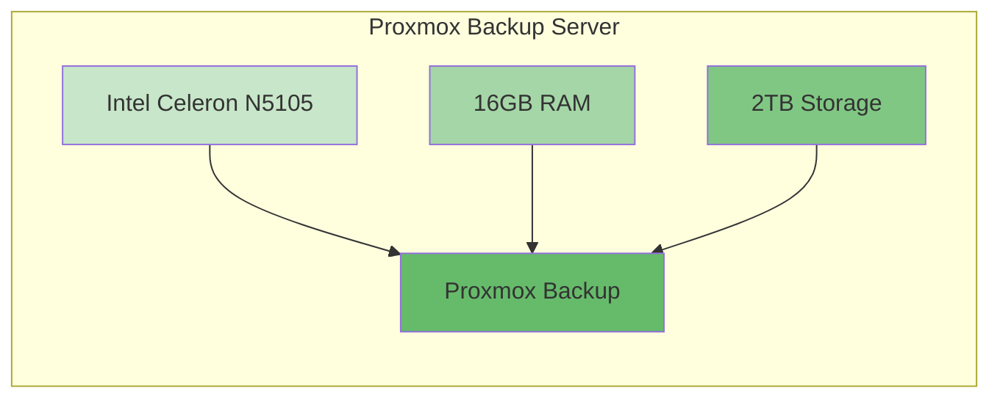
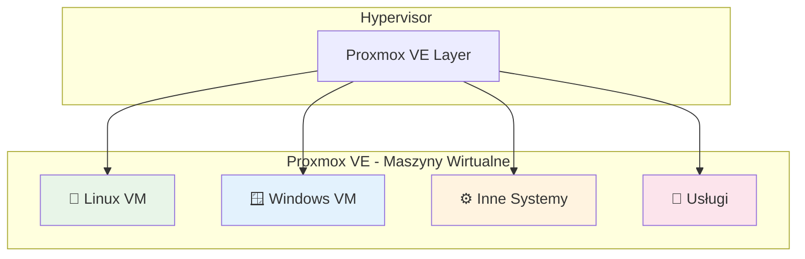
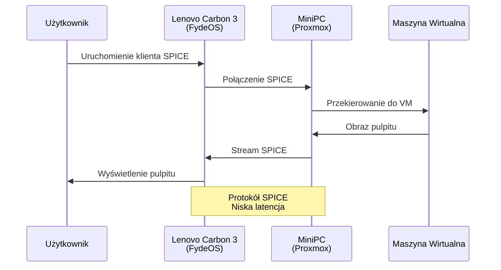
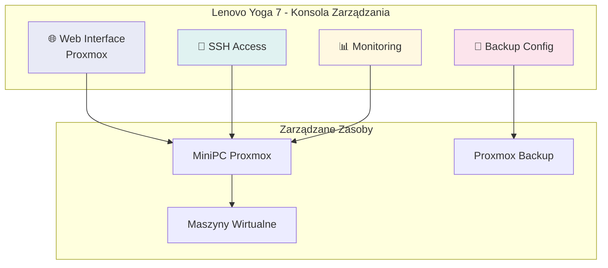
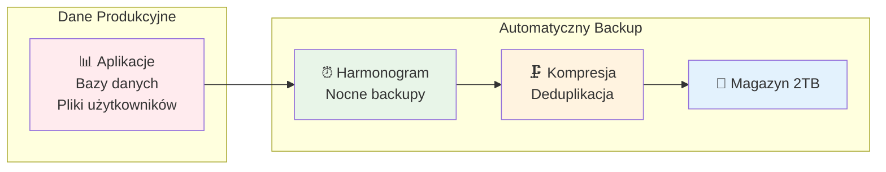

# Dokumentacja Infrastruktury Sieci Domowej z proxmox
storage, network, windows, linux, ...

Rozwiązanie dla środowiska domowego lub małego biura wymagającego profesjonalnej infrastruktury IT:
- **Wysoką dostępność** dzięki backupom
- **Elastyczność** przez wirtualizację
- **Bezpieczeństwo** przez izolację
- **Łatwość zarządzania** przez centralizację

Kompletna infrastruktura sieci domowej oparta na wirtualizacji, która składa się z:
- **Serwera głównego** z maszynami wirtualnymi
- **Serwera backupów** do zabezpieczania danych
- **Klienta cienkiego** do zdalnego dostępu
- **Stacji zarządzania** do administracji

## Diagram Ogólny Architektury

---

## Warstwa Fizyczna

### 1. Serwer Główny (MiniPC)

**Specyfikacja:**
- Procesor: Intel i7 (16 rdzeni)
- RAM: 64GB
- Hypervisor: Proxmox VE
- Rola: Główny serwer wirtualizacji

### 2. Serwer Backupów

**Specyfikacja:**
- Procesor: Intel Celeron N5105
- RAM: 16GB
- Magazyn: 2TB dedykowany dla backupów
- Funkcja: Automatyczne backupy maszyn wirtualnych

---

## Warstwa Wirtualizacji

**Funkcje:**
- **Linux VM**: Serwery aplikacji, kontenery Docker
- **Windows VM**: Aplikacje Windows, środowiska testowe
- **Inne systemy**: Specjalne dystrybucje, systemy embedded
- **Usługi**: Serwery baz danych, web serwery

---

## Warstwa Dostępu

### Klient Cienki (Lenovo Carbon 3)
- **System**: FydeOS (Chrome OS based)
- **Dodatkowe**: Android + Linux w kontenerach
- **Protokół**: SPICE dla zdalnego dostępu
- **Funkcja**: Bezpieczny, lekki dostęp do maszyn wirtualnych

---

## Warstwa Zarządzania

**Funkcje zarządzania:**
- **Proxmox Web UI**: Graficzny interfejs zarządzania
- **SSH**: Bezpośredni dostęp do konsoli
- **Monitoring**: Śledzenie zasobów i wydajności
- **Backup Management**: Konfiguracja i harmonogramy backupów

---

## Przepływ Danych

---

## Korzyści Architektury

### 🔒 Bezpieczeństwo
- Izolacja maszyn wirtualnych
- Regularne automatyczne backupy
- Zdalny dostęp przez szyfrowane protokoły

### ⚡ Wydajność
- Dedykowany serwer backupów (bez wpływu na wydajność główną)
- Klient cienki - niskie opóźnienia SPICE
- Efektywne wykorzystanie zasobów przez wirtualizację

### 🛠️ Zarządzanie
- Centralne zarządzanie z jednego laptopa
- Web interface dla łatwej administracji
- Automatyzacja backupów

### 📈 Skalowalność
- Łatwe dodawanie nowych maszyn wirtualnych
- Możliwość rozszerzania pamięci masowej
- Elastyczna alokacja zasobów
