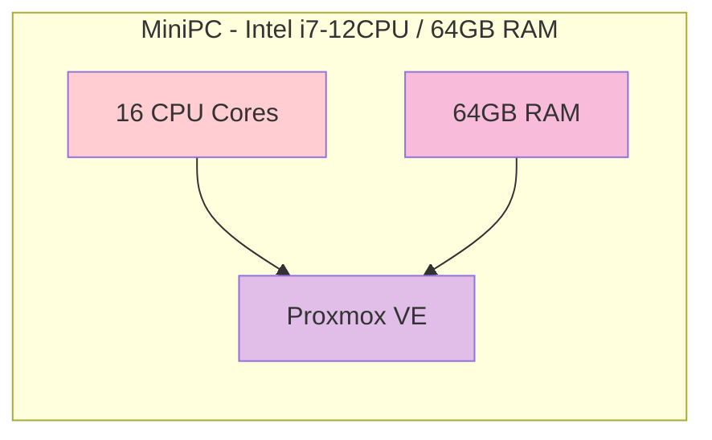

# Dokumentacja Infrastruktury Sieci Domowej z proxmox
storage, network, windows, linux, ...

Rozwiązanie dla środowiska domowego lub małego biura wymagającego profesjonalnej infrastruktury IT:
- **Wysoką dostępność** dzięki backupom
- **Elastyczność** przez wirtualizację
- **Bezpieczeństwo** przez izolację
- **Łatwość zarządzania** przez centralizację

Kompletna infrastruktura sieci domowej oparta na wirtualizacji, która składa się z:
- **Serwera głównego** z maszynami wirtualnymi
- **Serwera backupów** do zabezpieczania danych
- **Klienta cienkiego** do zdalnego dostępu
- **Stacji zarządzania** do administracji


## Diagram Ogólny Architektury

```mermaid
graph TB
    subgraph "SIEĆ LOKALNA"
        A[Lenovo Yoga 7<br/>💻 Zarządzanie] 
        B[MiniPC i7<br/>🖥️ Proxmox VE]
        C[Proxmox Backup<br/>💾 Celeron N5105]
        D[Lenovo Carbon 3<br/>📱 FydeOS Client]
    end
    
    A -->|SSH/HTTPS<br/>Zarządzanie| B
    A -->|Konfiguracja<br/>Backupów| C
    B -->|Automatyczne<br/>Backupy| C
    D -->|SPICE Protocol<br/>Zdalny dostęp| B
    
    style A fill:#e1f5fe
    style B fill:#f3e5f5
    style C fill:#e8f5e8
    style D fill:#fff3e0
```



### ASCII - Architektura Ogólna
```
    ┌─────────────────────────────────────────────────────────────┐
    │                      SIEĆ LOKALNA                          │
    │                                                             │
    │   ┌─────────────────┐         ┌─────────────────────────┐   │
    │   │  Lenovo Yoga 7  │         │     MiniPC Intel i7     │   │
    │   │  💻 Zarządzanie │◄────────┤     🖥️ Proxmox VE      │   │
    │   │                 │SSH/HTTPS│     16CPU/64GB RAM     │   │
    │   └─────────────────┘         └─────────────────────────┘   │
    │            │                              │                 │
    │            │ Konfiguracja                 │ Automatyczne    │
    │            │ Backupów                     │ Backupy         │
    │            ▼                              ▼                 │
    │   ┌─────────────────┐         ┌─────────────────────────┐   │
    │   │ Proxmox Backup  │◄────────┤   Lenovo Carbon 3       │   │
    │   │ 💾 Celeron N5105│         │   📱 FydeOS Client      │   │
    │   │ 16GB RAM/2TB    │         │   SPICE Protocol        │   │
    │   └─────────────────┘         └─────────────────────────┘   │
    │                                                             │
    └─────────────────────────────────────────────────────────────┘
```


## Warstwa Fizyczna

### 1. Serwer Główny (MiniPC)



#### ASCII - Serwer Główny
```
    ┌─────────────────────────────────────────────────────────┐
    │           MiniPC - Intel i7-12CPU / 64GB RAM            │
    │                                                         │
    │  ┌─────────────┐    ┌─────────────┐    ┌─────────────┐  │
    │  │ 16 CPU      │    │   64GB      │    │  Proxmox    │  │
    │  │ Cores       │───►│   RAM       │───►│     VE      │  │
    │  │             │    │             │    │             │  │
    │  └─────────────┘    └─────────────┘    └─────────────┘  │
    │                                                         │
    └─────────────────────────────────────────────────────────┘
```

**Specyfikacja:**
- Procesor: Intel i7 (16 rdzeni)
- RAM: 64GB
- Hypervisor: Proxmox VE
- Rola: Główny serwer wirtualizacji

### 2. Serwer Backupów


#### ASCII - Serwer Backupów
```
    ┌───────────────────────────────────────────────────────────┐
    │                Proxmox Backup Server                      │
    │                                                           │
    │  ┌─────────────┐  ┌─────────────┐  ┌─────────────┐        │
    │  │Intel Celeron│  │   16GB      │  │    2TB      │        │
    │  │    N5105    │  │    RAM      │  │  Storage    │        │
    │  │             │  │             │  │             │        │
    │  └─────────────┘  └─────────────┘  └─────────────┘        │
    │         │                │                │               │
    │         └────────────────┼────────────────┘               │
    │                          ▼                                │
    │                 ┌─────────────────┐                       │
    │                 │ Proxmox Backup  │                       │
    │                 │     Service     │                       │
    │                 └─────────────────┘                       │
    │                                                           │
    └───────────────────────────────────────────────────────────┘
```
**Specyfikacja:**
- Procesor: Intel Celeron N5105
- RAM: 16GB
- Magazyn: 2TB dedykowany dla backupów
- Funkcja: Automatyczne backupy maszyn wirtualnych

---

## Warstwa Wirtualizacji

```mermaid
graph TB
    subgraph "Proxmox VE - Maszyny Wirtualne"
        VM1[🐧 Linux VM]
        VM2[🪟 Windows VM]
        VM3[⚙️ Inne Systemy]
        VM4[🔧 Usługi]
    end
    
    subgraph "Hypervisor"
        PROX_LAYER[Proxmox VE Layer]
    end
    
    PROX_LAYER --> VM1
    PROX_LAYER --> VM2
    PROX_LAYER --> VM3
    PROX_LAYER --> VM4
    
    style VM1 fill:#e8f5e8
    style VM2 fill:#e3f2fd
    style VM3 fill:#fff3e0
    style VM4 fill:#fce4ec
```


### ASCII - Warstwa Wirtualizacji
```
    ┌─────────────────────────────────────────────────────────────────┐
    │                  Proxmox VE - Hypervisor                        │
    │                                                                 │
    │  ┌─────────────────────────────────────────────────────────┐    │
    │  │              Proxmox VE Layer                           │    │
    │  └─────────────────────────────────────────────────────────┘    │
    │                              │                                  │
    │              ┌───────────────┼───────────────┐                  │
    │              │               │               │                  │
    │              ▼               ▼               ▼                  │
    │   ┌─────────────────┐  ┌─────────────────┐  ┌─────────────────┐ │
    │   │   🐧 Linux VM   │  │  🪟 Windows VM  │  │ ⚙️ Inne Systemy │ │
    │   │                 │  │                 │  │                 │ │
    │   │ • Serwery app   │  │ • Aplikacje Win │  │ • Embedded      │ │
    │   │ • Docker        │  │ • Środowiska    │  │ • Specjalne     │ │
    │   │ • Bazy danych   │  │   testowe       │  │   dystrybucje   │ │
    │   └─────────────────┘  └─────────────────┘  └─────────────────┘ │
    │                              │                                  │
    │                              ▼                                  │
    │                    ┌─────────────────┐                          │
    │                    │   🔧 Usługi     │                          │
    │                    │                 │                          │
    │                    │ • Web serwery   │                          │
    │                    │ • API services  │                          │
    │                    │ • Monitoring    │                          │
    │                    └─────────────────┘                          │
    │                                                                 │
    └─────────────────────────────────────────────────────────────────┘
```

**Funkcje:**
- **Linux VM**: Serwery aplikacji, kontenery Docker
- **Windows VM**: Aplikacje Windows, środowiska testowe
- **Inne systemy**: Specjalne dystrybucje, systemy embedded
- **Usługi**: Serwery baz danych, web serwery

---

## Warstwa Dostępu

```mermaid
sequenceDiagram
    participant U as Użytkownik
    participant LC as Lenovo Carbon 3<br/>(FydeOS)
    participant MP as MiniPC<br/>(Proxmox)
    participant VM as Maszyna Wirtualna
    
    U->>LC: Uruchomienie klienta SPICE
    LC->>MP: Połączenie SPICE
    MP->>VM: Przekierowanie do VM
    VM->>MP: Obraz pulpitu
    MP->>LC: Stream SPICE
    LC->>U: Wyświetlenie pulpitu
    
    Note over LC,MP: Protokół SPICE<br/>Niska latencja
```


### ASCII - Sekwencja Dostępu SPICE
```
    Użytkownik    Lenovo Carbon 3    MiniPC         Maszyna
                     (FydeOS)       (Proxmox)      Wirtualna
         │              │              │              │
         │ Uruchomienie │              │              │
         │ klienta SPICE│              │              │
         │─────────────►│              │              │
         │              │  Połączenie  │              │
         │              │    SPICE     │              │
         │              │─────────────►│              │
         │              │              │Przekierowanie│
         │              │              │    do VM     │
         │              │              │─────────────►│
         │              │              │              │
         │              │              │ Obraz pulpitu│
         │              │              │◄─────────────│
         │              │ Stream SPICE │              │
         │              │◄─────────────│              │
         │ Wyświetlenie │              │              │
         │   pulpitu    │              │              │
         │◄─────────────│              │              │
         │              │              │              │
         
         ┌─────────────────────────────────────────────────────┐
         │            Protokół SPICE                           │
         │            Niska latencja                           │
         └─────────────────────────────────────────────────────┘
```

### Klient Cienki (Lenovo Carbon 3)
- **System**: FydeOS (Chrome OS based)
- **Dodatkowe**: Android + Linux w kontenerach
- **Protokół**: SPICE dla zdalnego dostępu
- **Funkcja**: Bezpieczny, lekki dostęp do maszyn wirtualnych

---

## Warstwa Zarządzania


### ASCII - Warstwa Zarządzania
```
    ┌────────────────────────────────────────────────────────────┐
    │              Lenovo Yoga 7 - Konsola Zarządzania           │
    │                                                            │
    │  ┌─────────────┐  ┌─────────────┐  ┌─────────────┐         │
    │  │🌐 Web       │  │🔐 SSH       │  │📊 Monitoring│         │
    │  │Interface    │  │Access       │  │             │         │
    │  │Proxmox      │  │             │  │             │         │
    │  └─────────────┘  └─────────────┘  └─────────────┘         │
    │         │                │                │                │
    │         └────────────────┼────────────────┘                │
    │                          ▼                                 │
    │                 ┌─────────────────┐                        │
    │                 │  MiniPC Proxmox │                        │
    │                 │                 │                        │
    │                 └─────────────────┘                        │
    │                          │                                 │
    │                          ▼                                 │
    │                 ┌─────────────────┐                        │
    │                 │ Maszyny         │                        │
    │                 │ Wirtualne       │                        │
    │                 └─────────────────┘                        │
    │                                                            │
    │  ┌─────────────────────────────────────────────────────┐   │
    │  │             💾 Backup Config                        │   │
    │  │                      │                              │   │
    │  │                      ▼                              │   │
    │  │            ┌─────────────────┐                      │   │
    │  │            │ Proxmox Backup  │                      │   │
    │  │            │                 │                      │   │
    │  │            └─────────────────┘                      │   │
    │  └─────────────────────────────────────────────────────┘   │
    │                                                            │
    └────────────────────────────────────────────────────────────┘
```

**Funkcje zarządzania:**
- **Proxmox Web UI**: Graficzny interfejs zarządzania
- **SSH**: Bezpośredni dostęp do konsoli
- **Monitoring**: Śledzenie zasobów i wydajności
- **Backup Management**: Konfiguracja i harmonogramy backupów

---

## Przepływ Danych

```mermaid
flowchart LR
    subgraph "Dane Produkcyjne"
        PROD[📊 Aplikacje<br/>Bazy danych<br/>Pliki użytkowników]
    end
    
    subgraph "Automatyczny Backup"
        SCHEDULE[⏰ Harmonogram<br/>Nocne backupy]
        COMPRESS[🗜️ Kompresja<br/>Deduplikacja]
        STORE[💾 Magazyn 2TB]
    end
    
    PROD --> SCHEDULE
    SCHEDULE --> COMPRESS
    COMPRESS --> STORE
    
    style PROD fill:#ffebee
    style SCHEDULE fill:#e8f5e8
    style COMPRESS fill:#fff3e0
    style STORE fill:#e3f2fd
```


### ASCII - Przepływ Danych
```
    ┌───────────────────────────────────────────────────────────┐
    │                    PRZEPŁYW DANYCH                        │
    │                                                           │
    │  ┌─────────────────────┐                                  │
    │  │   Dane Produkcyjne  │                                  │
    │  │                     │                                  │
    │  │ 📊 Aplikacje        │                                  │
    │  │ 🗃️ Bazy danych      │                                  │
    │  │ 📁 Pliki użytkowników│                                 │
    │  │                     │                                  │
    │  └─────────────────────┘                                  │
    │              │                                            │
    │              ▼                                            │
    │  ┌────────────────────────────────────────────────────┐   │
    │  │            Automatyczny Backup                     │   │
    │  │                                                    │   │
    │  │  ⏰ Harmonogram     🗜️ Kompresja      💾 Magazyn   │   │
    │  │  Nocne backupy ──► Deduplikacja ──►    2TB         │   │
    │  │                                                    │   │
    │  │  • Codziennie      • Zmniejszenie     • Bezpieczne │   │
    │  │    o 02:00           rozmiaru           przechow.  │   │
    │  │  • Inkrementalne   • Usunięcie         • Szybki    │   │
    │  │    kopie             duplikatów          dostęp    │   │
    │  │                                                    │   │
    │  └────────────────────────────────────────────────────┘   │
    │                                                           │
    └───────────────────────────────────────────────────────────┘
```
---

## Korzyści Architektury

### 🔒 Bezpieczeństwo
- Izolacja maszyn wirtualnych
- Regularne automatyczne backupy
- Zdalny dostęp przez szyfrowane protokoły

### ⚡ Wydajność
- Dedykowany serwer backupów (bez wpływu na wydajność główną)
- Klient cienki - niskie opóźnienia SPICE
- Efektywne wykorzystanie zasobów przez wirtualizację

### 🛠️ Zarządzanie
- Centralne zarządzanie z jednego laptopa
- Web interface dla łatwej administracji
- Automatyzacja backupów

### 📈 Skalowalność
- Łatwe dodawanie nowych maszyn wirtualnych
- Możliwość rozszerzania pamięci masowej
- Elastyczna alokacja zasobów
